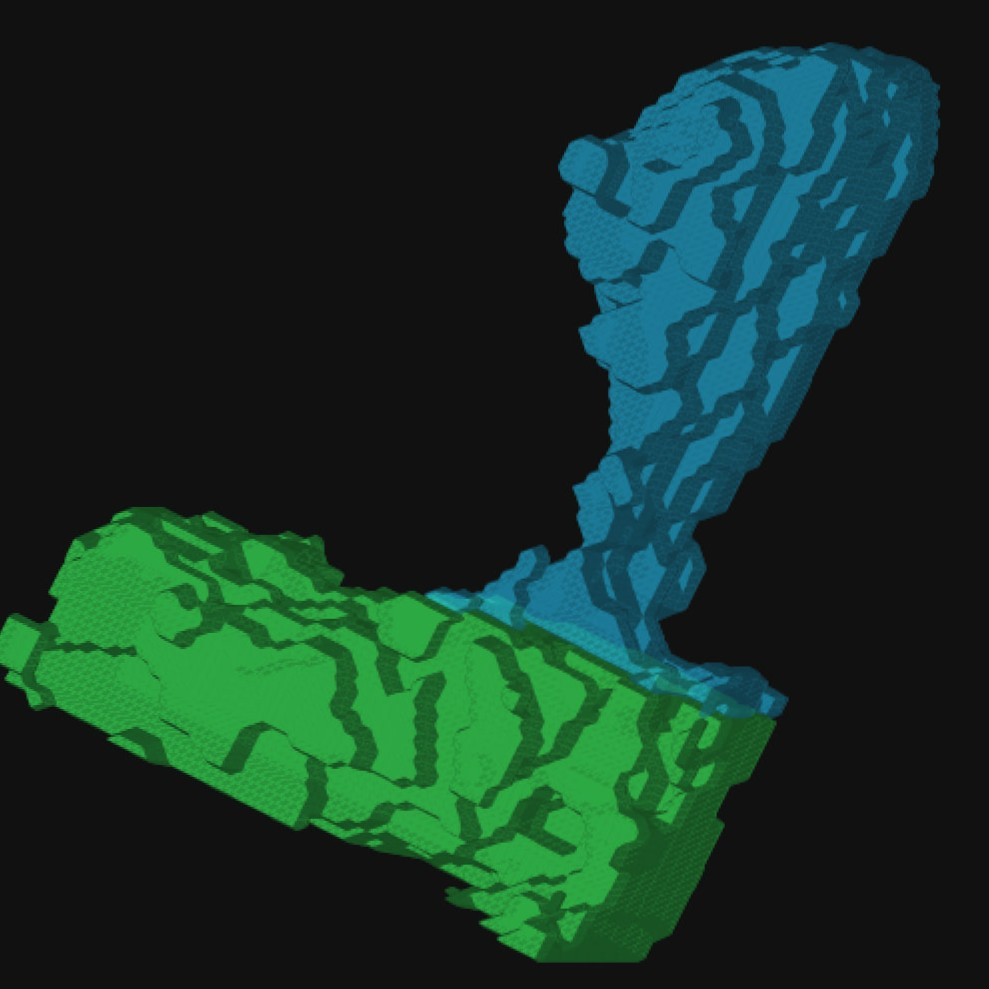

# Synpo Microscopy Processor

<p align="center">
  
</p>

Synpo is a Windows and macOS desktop application for processing paired-channel, 3D microscopy recordings of dendrites, dendritic spines, and protein clusters. It supports large batches from TIFF import through preprocessing, automatic 3D segmentation, optional guided correction, measurement, spine-distribution review, and Excel/CSV export.

This is the **0.8.0 beta release**. It is intended for supervised scientific use: review segmentation and centerline results before relying on exported measurements.

## Main features

- Imports registered, paired 16-bit TIFF Z-stacks with identical dimensions.
- Supports the original metadata filename schema, configurable channel markers such as `cy`/`cl`, and manually selected A/B files from the same or different folders.
- Organizes parsed specimens into experimental groups; metadata-free batches can use one editable fallback group.
- Applies adaptive per-stack background correction, threshold estimation, and Gaussian smoothing without modifying source TIFFs.
- Detects dendrites, closely touching spine candidates, and protein-cluster candidates in 3D.
- Automatically switches oversized specimens to slower disk-backed detection when the ordinary method would exceed the project's 80% RAM ceiling. A per-project setting can use low-memory detection for every specimen.
- Shows scrollable Z slices, XY/XZ/YZ maximum projections, linked orthogonal views, zoom/pan controls, and cropped rotatable 3D surfaces.
- Provides separate X/Y/Z rotation controls, adjustable Z-layer spacing, colors, and surface opacity for publication-oriented 3D snapshots.
- Accepts optional drawing hints for local resegmentation. Each missed-object hint produces a separate object whose boundary follows the preprocessed image signal.
- Measures dendrites, individual spines, and qualifying clusters. Intensity measurements always use the original 16-bit voxels.
- Measures protein distribution in ten equal-length parts along each spine's curved 3D centerline.
- Allows an optional point hint to correct the distal centerline endpoint while preserving the automatically detected base.
- Provides protein-cluster-positive and optional cluster-less spine review, invalid-spine exclusion, stable spine numbering, full-field context, and a filterable numbered spine map.
- Displays experimental-group distribution profiles with SEM error bars.
- Shows responsive batch progress bars with completed work, elapsed time, and a rough remaining-time estimate for preprocessing, detection, and measurement.
- Exports verified Excel and CSV tables, settings, audit information, and optional validation PDFs.

Synpo calculates measurements only. Perform statistical hypothesis testing in separate statistics software.

## Requirements

- Windows 10/11; macOS 12+ on Intel or Apple Silicon; or the separate legacy environment for Intel macOS 10.15 Catalina and macOS 11
- Anaconda, Miniconda, or Miniforge
- Sufficient free disk space for the compressed project cache, exports, and temporary low-memory detection data

Synpo is designed for ordinary laptop hardware and limits itself to at most 80% of available RAM. Large stacks are processed with a disk-backed Z-slab method that merges objects crossing slab boundaries. Synpo checks the required temporary space before starting each such specimen. If space is insufficient, that specimen remains retryable and the rest of the batch continues.

## Installation

The environment is named `synpo-microscopy`. Synpo never modifies a separate environment named `synpo`.

### Windows

Download or clone this repository and double-click `launch_synpo.bat`. It searches the active Conda installation, its saved choice, `PATH`, Conda's environment registry, the Windows registry, and common Anaconda, Miniconda, Miniforge, and Mambaforge locations. Custom installation directories and custom Conda `envs_dirs` are supported. If automatic discovery fails, select the Conda installation folder once; if the environment is missing, approve its creation when prompted.

The choice is saved in `%APPDATA%\Synpo\launcher-conda.txt`. Delete that file to select another installation. Manual setup is also available from an **Anaconda Prompt**:

```powershell
conda env create -f environment.yml
conda env update -n synpo-microscopy -f environment.yml --prune
launch_synpo.bat
```

To create a Synpo desktop shortcut with the supplied icon, run once:

```powershell
powershell -ExecutionPolicy Bypass -File .\scripts\create_desktop_shortcut.ps1
```

### macOS

The standard environment supports Intel and Apple Silicon Macs on macOS 12 or newer. A separate legacy environment supports Intel macOS 10.15 Catalina and macOS 11 on Intel or Apple Silicon. The legacy file pins Python 3.10 and the official PySide6 6.2.4 wheel, keeping it isolated from current systems.

In Terminal, make the launcher executable once and open it:

```bash
chmod +x launch_synpo.command
./launch_synpo.command
```

It can subsequently be opened from Finder. Like the Windows launcher, it discovers Conda and custom environment locations automatically, presents a native folder picker only when necessary, remembers the successful choice in `~/Library/Application Support/Synpo/launcher-conda.txt`, and offers to create the OS-appropriate environment. If macOS blocks this unsigned beta script, right-click it, choose **Open**, and confirm once; do not disable Gatekeeper globally.

Catalina users need the archived [Miniforge release that supports macOS 10.13-10.15](https://github.com/conda-forge/miniforge/releases/tag/26.1.1-3). Catalina dependency resolution has been verified; final application and representative-dataset testing must be performed on a Catalina Mac before treating that path as field-validated.

## Importing TIFF files

All recordings must be registered 3D stacks. The two files in a specimen pair must have identical dimensions.

Synpo supports three import methods.

### Original metadata filenames

```text
<batch prefix>_<experimental group>_<specimen ID>_ChanA_registered.tif
<batch prefix>_<experimental group>_<specimen ID>_ChanB_registered.tif
```

### Configurable channel markers

Enter the marker used for each channel before scanning a folder. For example, markers `cy` and `cl` pair:

```text
Untitled001cy.tif
Untitled001cl.tif
```

When the other metadata fields are absent, the batch is placed in the selected fallback experimental group and the paired filename becomes the editable specimen name. The `_registered` flag is optional in this mode.

### Manual pairing

Select **Manually choose one Channel A file and one Channel B file** to pair two individual TIFFs. The files may be in different folders. Synpo stores and verifies each source path independently; relinking can search a selected parent folder and its subfolders.

Channel roles are confirmed for every batch. By default, Channel A contains protein clusters and Channel B contains dendrites and spines. Always confirm the XY pixel size and Z step when starting a project; TIFF calibration metadata can be overridden and named presets reused.

## Typical workflow

1. Select and scan a TIFF folder, or manually choose one channel pair.
2. Confirm channel markers and roles, voxel calibration, experimental groups, specimen names, and output location.
3. Review both channels for every included specimen. Settings are independent by
   default; an optional checkbox fills only currently unmarked images without
   overwriting reviewed parameters. Exclude whole pairs with a reason or define
   multiple rectangular XY analysis ROIs when needed.
4. Preprocess the entire batch and run automatic detection.
5. Review detected specimens and optionally apply local corrections.
6. After at least one specimen is marked manual-review complete, calculate its
   measurements and begin protein-cluster-positive spine review.
7. Optionally review cluster-less spines and exclude invalid detections.
8. Export the workbook, CSV tables, and any requested validation PDFs.
9. Review all-spine centerline/head-neck geometry, then create and export one or
   more named morphology clustering analyses if needed.

Automatic checkpoints are written throughout preprocessing, detection, correction, and measurement. Completed specimens remain available if a later batch operation is cancelled or interrupted.

## Moving a project to another computer

Choose **Project → Create transfer ZIP…** and select either **Full project state**
or **Settings only**. Full state carries all cached processing, corrections, and
measurements. Settings only keeps calibration, parameters, labels, exclusions,
ROIs, and specimen comments while resetting analysis and correction history. Raw
TIFFs can optionally be included; they are excluded by default to keep the archive
smaller.

On the destination computer, choose **File → Open project or transfer ZIP…**,
select the ZIP, and choose where Synpo should create its project folder. If raw
TIFFs were not included, select their new parent folder. Synpo searches subfolders,
accepts exact filenames, and can identify renamed TIFFs by file size plus SHA-256.
The project opens only after validation succeeds. A damaged full cache may be
recovered explicitly as settings-only, and the original ZIP is never changed.

Detection uses **Automatic (fast when safe)** by default. Choose **Always use low-memory detection** in Stage 3 to use the disk-backed method for every pending specimen in that project. This execution choice does not invalidate completed masks. Detection reports completed, low-memory, skipped, and failed specimens separately; skipped or failed specimens are retried when the batch is run again.

## Review and visualization

The correction canvas can show an individual Z slice or a drawable XY maximum projection. Drawn hints are instructions rather than final masks. The brushes are:

- **Add — green:** draw separately inside missed objects. Touching new regions become one object; a new region touching exactly one existing object of the same category joins it, while ambiguous multiple-object contact is skipped.
- **Assign dendrite area to spine — lime:** on the drawable XY projection, touch exactly one spine and paint over shaft voxels that belong to it. Covered dendrite-mask voxels across every Z slice are transferred literally to that spine.
- **Assign spine area to dendrite — coral:** the reverse projection-only brush. Touch exactly one dendrite and paint over spine voxels that belong to it. Covered voxels from all touched spine IDs are transferred through every Z slice; ambiguous contact with multiple dendrites is rejected without changing the masks.
- **Exclude — red:** touch an unwanted object to remove that complete 3D object.
- **Trim — magenta:** draw across excess segmentation; Synpo removes the hint and keeps the largest connected image-supported remainder.
- **Expand — blue:** draw from an existing object toward missed signal so its boundary is regrown locally.
- **Split — yellow:** draw through a neck or contact. The two largest pieces seed
  exactly two output IDs and all smaller fragments join the physically nearest side.
- **Eraser:** clear only painted dendrite/spine voxels of either type. Slice mode
  affects one Z plane; XY projection mode clears the painted columns through Z.
- **Mark as filopodium — purple:** touch a spine to exclude it and record the filopodium decision in the audit trail.
- **Merge objects — `#ED6291`:** draw through at least two objects to combine them under one stable ID.
- **Accept — cyan:** retain the mask unchanged and record the object as accepted.
- **Needs attention — orange:** retain the mask unchanged and explicitly flag it for later review.

Add, Expand, and Trim use a per-application sensitivity slider; it is visibly disabled for other brushes. Higher sensitivity expands Add/Expand results and removes more weak signal during Trim. The brush diameter ranges from 1 to 1000 pixels. A display toggle assigns stable contrasting colors to individual dendrites and spines so their borders remain visible. Protein clusters are detected automatically and are not manually redrawn.

Dendrite and spine object colors are guaranteed distinct. Brush hotkeys are
Ctrl+1 through Ctrl+9 in the displayed tool order (Add, Exclude, Split, Merge,
spine-to-dendrite, dendrite-to-spine, Trim, Expand, Eraser), Ctrl+0 selects
Filopodium, and Enter applies the correction.

From Review, use the preprocessing or detection rerun buttons to edit parameters
for the selected specimen. A preprocessing rerun automatically continues into
detection. Either route warns before permanently discarding that specimen's manual
corrections and history.

The **Save project** button remains visible below every workflow step and saves committed state without applying pending controls.

Correction uses ordinary RAM when safe and automatically switches oversized edits to slower disk-backed processing. An **Always use slow low-memory correction** option is available for low-RAM computers, with undo retained in both modes.

For intermittent performance problems, **Advanced → Diagnostic mode** records
phase timings and two-second system samples in
`<output>/Synpo diagnostics/<timestamp>/`. Full-session capture is the default;
correction-only capture is also available, and diagnostics start disabled on every
launch. The report excludes microscopy pixels, comments, command lines, and window
titles, while sanitizing home-directory paths. **Finish and package diagnostic
session** creates a shareable ZIP. The Advanced menu also opens the single bundled
PDF protocol for controlled cross-machine testing. Review every report before
sharing it, and never disable workplace protection software without IT approval.

Maximum projections and 3D context are available during detection and correction. Their progress and Cancel control appear in the bottom status line instead of a modal popup. Before creating a 3D surface, select a rectangular area on the XY projection to control memory use. Dendrite and spine surfaces can be translucent while protein clusters remain opaque. Colors, opacity, rotation on all three axes, and displayed Z spacing are adjustable; these display settings never alter masks or measurements.

## Spine distribution review

Protein-cluster-positive spines are divided voxel-by-voxel into ten parts along a calibrated curved centerline from the shaft contact to the distal endpoint. For each part, Synpo saves spine volume, inside-cluster volume, and their ratio.

Exactly two meaningful disconnected spine pieces can be joined by a virtual
signal-guided centerline bridge up to 1.0 µm by default. It never changes the
segmentation mask or measured volume. The bridge is shown and exported, and the
spine stays out of distribution summaries until reviewed. Tiny satellite fragments
do not invalidate the main centerline. Failed bridges and spines with more than two
substantial pieces retain the path in the component nearest the dendrite and remain
flagged; a manual endpoint can select the intended distal component.

If the automatic centerline endpoint is correct, no action is required. Otherwise:

1. Select **Centerline end hint**.
2. Use the cropped Z viewer, whose slider is limited to slices occupied by that spine.
3. Click the desired distal endpoint on the spine.

The point snaps to the nearest voxel belonging to the selected spine, the centerline is rebuilt from the automatic base, and the review returns to the maximum projection. **Clear end hint** restores automatic endpoint detection.

Clicking either cropped channel view opens the full-specimen projection with the current spine highlighted by a thick bright-green outline; other spines use thick cyan outlines. **Open numbered spine map** shows all stable spine IDs with zoom, optional single-Z viewing, and filters for cluster-positive, cluster-less, valid, or invalid spines.

Cluster-less spine review is optional and never blocks export. Marking a spine invalid excludes it from all subsequent metrics, including spine density and the protein-inclusion percentage denominator, while preserving an auditable decision row.

## Results

Partial export is allowed: only pairs with completed measurement checkpoints are
included, and the measurement panel reports how many unfinished pairs were omitted.

The verified export contains:

- Master specimen-, dendrite-, spine-, and cluster-level measurements.
- ROI coordinates and per-ROI summaries, plus pooled specimen metrics and an
  excluded-specimen audit table.
- One row per individual included cluster plus per-spine cluster sums.
- Individual ten-part protein distributions for every qualifying spine.
- Specimen and experimental-group summaries with counts, means, variability, inclusion percentages, and SEM profiles.
- Excluded-distribution, invalid-spine, and spine-review audit tables.
- Calibration, measurement, and distribution settings.
- Optional two-panel PDF pages showing reviewed spines and distribution profiles.

The measurement panel can apply one reversible calibrated spine-volume cutoff
without changing masks or rerunning measurements. Its preview includes a histogram,
group/specimen removal counts, warnings, and per-spine Keep overrides. Spines below
the cutoff and their linked cluster/distribution rows are omitted, every supported
summary is recalculated, and a dedicated audit plus a numeric valid-spine volume
distribution sheet are exported. Manual invalidity remains independent and cannot
be overridden by the volume filter.

**File -> Filter exported measurement workbook...** performs the same exact
recalculation from a Synpo `.xlsx` when the project and TIFF files are unavailable.
It creates a new workbook and matching CSV directory, preserves user-added sheets,
and writes a compatibility report for legacy tables it cannot exactly reconstruct.
Standalone mode does not regenerate PDFs.

## Morphology clustering

The **6. Morphology clustering** panel measures and reviews every valid spine,
whether or not it contains protein puncta. The ordinary measurement export adds
curvilinear shaft-contact-to-tip length and straight base-to-tip distance with
centerline QC fields. Point tools correct the centerline base and tip; head/neck
brushes work on either one Z slice or the XY maximum projection, with undo/redo and
review checkpoints. Brush processing and geometry recalculation are backgrounded
to keep the interface responsive. Checkpoint-and-advance opens the following spine,
and an invalid-spine option excludes a reviewed spine from all downstream metrics.

Named runs provide Gaussian-mixture, Ward, and k-means clustering; selectable
morphology features; robust, z-score, or unscaled inputs; adjustable 1-10 cluster
search; and 2D or 3D PCA plots. Linear, logarithmic, and square-root volume choices
are available. Protein-puncta values are deliberately excluded from PCA and
cluster formation. They are used only for plots and descriptive summaries of the
resulting morphology clusters, both across all spines and within protein-positive
spines.

Automatic cluster-count selection can use the information criterion, maximum
silhouette score, or an elbow detector on the within-cluster SSE curve. The elbow
method requires at least three accepted candidate counts. Minimum cluster-size
rules are applied first, all candidate diagnostics are exported, and a fixed count
overrides the automatic method.

The standard and advanced clustering tabs also provide a cluster-count score panel
with an annotated score curve and exact-value table for all three methods. Rejected
small-cluster candidates and the solution selected for the saved run are identified.

A **Cluster geometry-reviewed spines only** checkbox switches between all otherwise
valid spines and only those explicitly marked **Geometry checked**. The selection
is saved with each named run, and omitted unreviewed spines remain visible in the
analysis exclusion audit.

One or more experimental groups can be selected for each named run. Scatter plots
show group membership with distinct marker shapes while preserving cluster colors.
Axes and background colors and opacity are editable and are retained in exported
figures. Plot legends can be hidden or placed inside, outside-right, or below the
plot. Any two selected clustering features can be plotted against one another using
their exact transformed values, and protein-puncta volume views include the
individual observations as well as box plots. Puncta point colors identify
morphology clusters, marker shapes identify experimental groups, and the legend
distinguishes colored individual-spine points from hollow black box-plot outliers.

The **PCA interpretation** view shows spine scores and numbered loading vectors,
a loading heatmap, explained variance, and the explicit linear formula for each
displayed component. Three-component runs use a rotatable 3D PC1/PC2/PC3 view;
two-component runs remain 2D. Exported `PCA_Equations` and `PCA_Feature_Preparation` sheets
record the full-precision formulas and every transformation, scale, and centering
value needed to reproduce the PCA scores.
A separate full-size **3D PCA with feature axes** view and exported figure are
available for three-component runs.
The interpretation and feature-axis views can fade their spine points with a
point-opacity setting or hide them entirely, leaving the loading vectors visible;
the setting is saved with the named run and used for plot exports.

The separate **7. Advanced clustering** tab adds actual higher-dimensional UMAP
and PCC/PCUMAP (Gildenblat and Pahnke) clustering while retaining PCA as the
default interpretable baseline in tab 6. Users choose a 2-20 dimensional embedding
and a 2D or 3D view; Gaussian mixture, Ward, or k-means receives the full fitted
embedding as its clustering input. Plot color identifies cluster and marker shape
identifies experimental group. Protein puncta remain descriptive-only.

UMAP controls include neighbors, minimum distance, metric, iterations, and seed.
PCC/PCUMAP also exposes reference points, beta, correlation-loss weight/start, and
compute device. Named advanced runs save all settings and report trustworthiness,
distance-rank preservation, and repeated-seed embedding and cluster stability.
Exports include every embedding coordinate, dedicated diagnostic/stability sheets
and CSVs, and high-resolution nonlinear plots. The current environment uses
TorchDR for UMAP and PCUMAP; the legacy macOS UMAP fallback can take longer on its
first fit while Numba compiles.

The separate morphology package contains Excel and CSV data, candidate-model and
specimen-bootstrap stability and audit tables, editable cluster colors, a PDF
report, vector PDF/SVG figures, and 600-DPI PNG figures. A saved morphology
workbook can also be re-clustered through
**File -> Cluster exported morphology workbook...** without the original project
or TIFF files.

Source TIFFs are never modified. The compressed project cache can be removed after final export has been verified.

## Beta-release notes

- Spine-volume filtering can now be applied reversibly inside a project or directly
  to an exported workbook, with linked rows removed and supported summaries
  recalculated from the remaining valid spines.
- All-spine morphology review adds editable base/tip and head/neck geometry,
  calibrated spine lengths, manual invalid-spine exclusion, and responsive
  maximum-projection painting.
- Named morphology analyses now support PCA, UMAP, and PCC/PCUMAP; GMM, Ward, and
  k-means; reviewed-only and experimental-group subsets; configurable plots and
  high-resolution exports; explicit PCA equations and feature vectors; and
  descriptive-only protein-puncta summaries.
- Automatic cluster-count selection offers information criterion, silhouette, and
  elbow methods. Candidate-score panels show exact scores for every cluster count,
  and PCA feature-vector views can fade or hide spine points.
- Projects can now be moved between computers as validated compressed transfer
  ZIPs. Full transfers retain cached results and corrections; settings-only
  transfers retain setup and specimen comments while resetting derived state.
- Preprocessing now uses independent per-specimen parameters, reviewed markers,
  specimen exclusion, multiple rectangular analysis ROIs, direct Z-slider mapping,
  keyboard specimen navigation, and explicit per-specimen preprocessing/detection
  reruns.
- Manual correction adds a literal eraser, exactly-two-way splitting, fixed brush
  hotkeys, Enter-to-apply, and disjoint dendrite/spine object colors.
- Disconnected two-part spines can use a review-required virtual centerline bridge;
  tiny satellite fragments no longer unnecessarily discard a usable main path.
- Opt-in diagnostics can package privacy-conscious performance evidence and include
  a bundled cross-machine testing protocol.
- Manual correction now includes projection-only dendrite-to-spine and
  spine-to-dendrite transfer brushes, automatic joining of newly added objects to
  one touching object of the same category, adjustable resegmentation sensitivity,
  distinct colors for individual dendrites and spines, brush diameters up to 1000
  pixels, and a Save project button available throughout the workflow.
- Windows and macOS launchers discover Conda installations and environments in nonstandard folders; successful choices are remembered per user.
- The macOS launcher is Conda-backed rather than a signed/notarized `.app`. Catalina dependency resolution is verified, but Catalina and Apple Silicon field testing remain in progress.
- Closely touching structures and unusual morphology may require review or correction.
- Filopodia are retained as candidates and can be excluded during review.
- Automatically retained somata and axons should be removed with the correction tools.
- Remaining-time estimates are approximate and stabilize after several slices or specimens.
- Segmentation-mask and ImageJ ROI ZIP export are not yet included in this beta release.
- Report problems or suggestions through this repository's GitHub Issues page.
